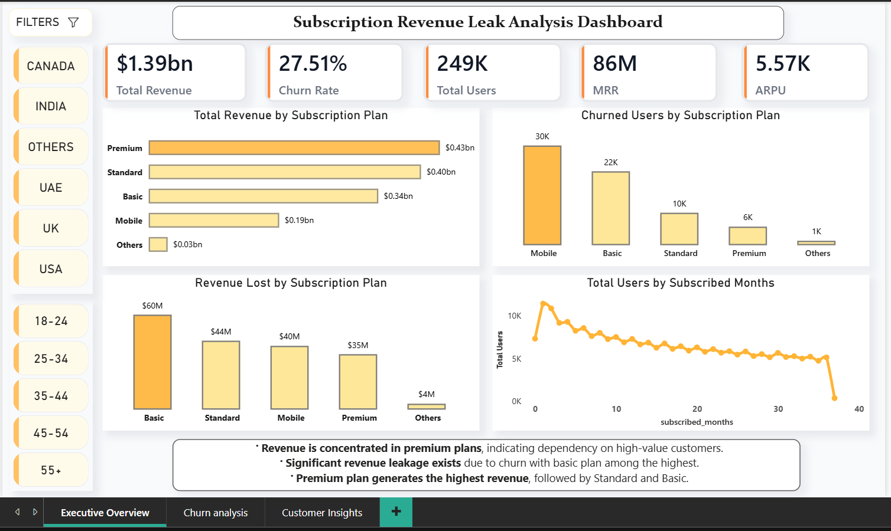
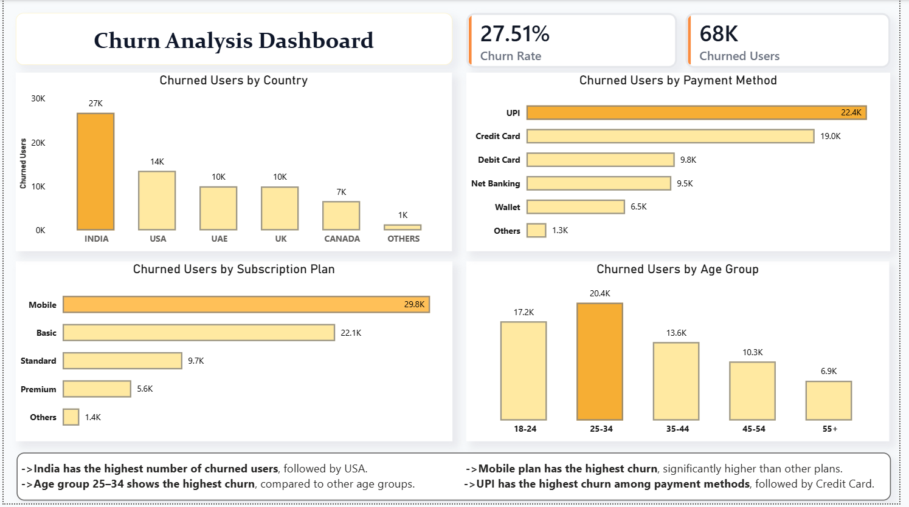
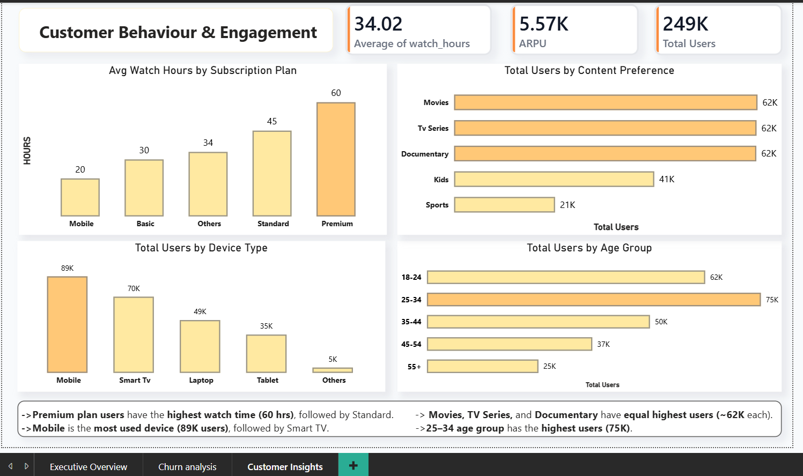

# 📊 Digital Subscription Revenue Leak Analysis

## 📌 Project Overview

This project analyzes a **subscription-based digital platform** to identify **revenue leakage, churn patterns, and customer behavior insights**.

The goal is to simulate a real-world business scenario (like Netflix/SaaS platforms) and provide **data-driven recommendations** to improve **customer retention and revenue growth**.

---

## 🎯 Business Problem

Subscription businesses often face **revenue loss due to churn, payment failures, and low engagement**.

This project answers key questions:

* Why are customers churning?
* Which subscription plans generate maximum revenue?
* Where is revenue leakage happening?
* How does user behavior impact retention?

---

## 🛠️ Tools & Technologies Used

* **Python (Pandas, NumPy)** → Data Cleaning & Analysis
* **SQL (concepts applied)** → Data understanding
* **Power BI** → Dashboard & Visualization
* **Excel/CSV** → Data storage

---

## 📂 Project Structure

```
Digital-Subscription-Revenue-Leak-Analysis/
│
├── data/
│   ├── raw/                # Original dataset
│   └── processed/          # Cleaned dataset
│
├── notebooks/
│   └── analysis.ipynb      # Data analysis in Python
│
├── powerbi/
│   └── dashboard.pbix      # Power BI dashboard
│
├── images/
│   ├── executive_overview.png
│   ├── churn_analysis.png
│   └── customer_behavior.png
│
├── README.md
└── requirements.txt
```

---

## 🔍 Key Metrics Analyzed

* **Churn Rate**
* **Monthly Recurring Revenue (MRR)**
* **Average Revenue Per User (ARPU)**
* **Revenue Lost due to Churn**
* **Total Users & Active Users**

---

## 📊 Dashboard Overview

### 1️⃣ Executive Overview

* KPIs: Revenue, Churn Rate, Users, MRR, ARPU
* Revenue distribution across subscription plans
* Revenue leakage analysis

### 2️⃣ Churn Analysis

* Churn by country, plan, and payment method
* High-risk customer segments identified

### 3️⃣ Customer Behaviour & Engagement

* Watch hours analysis
* Device usage trends
* Content preferences
* Age group behavior

---

## 💡 Key Insights

* Premium plan generates the **highest revenue**, but dependency on high-value users is high
* Basic plan shows **maximum revenue leakage due to churn**
* **UPI payment method has highest churn**, indicating payment-related issues
* **Age group 25–34 has highest churn and highest user base**
* Higher engagement (watch hours) leads to better retention

---

## 📈 Business Recommendations

* Improve retention strategies for **Basic plan users**
* Optimize **payment systems (especially UPI auto-renewal)**
* Target **25–34 age group with personalized offers**
* Increase engagement through **content recommendations**
* Provide incentives for **long-term subscriptions**

---

## 📸 Dashboard Screenshots

### Executive Overview



### Churn Analysis



### Customer Behaviour



---

## 🚀 How to Run This Project

1. Clone the repository:

```
git clone https://github.com/your-username/Digital-Subscription-Revenue-Leak-Analysis.git
```

2. Install dependencies:

```
pip install -r requirements.txt
```

3. Open:

* Jupyter Notebook → `Notebook/subscription_revenue_leak_analysis.ipynb`
* Power BI → `Dashboard/Subscription Revenue Leak Analysis Dashbroad.pbix`

---

## 📌 Conclusion

This project demonstrates how data analysis can help businesses **identify revenue leakage, understand customer behavior, and improve decision-making**.

---

## 👤 Author

**Chaitanya Sharma**

* Aspiring Data Analyst
* Skilled in Python, SQL, Power BI
